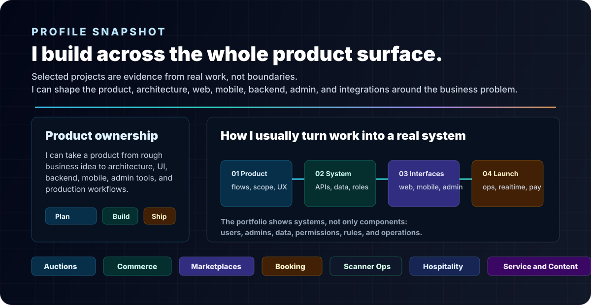
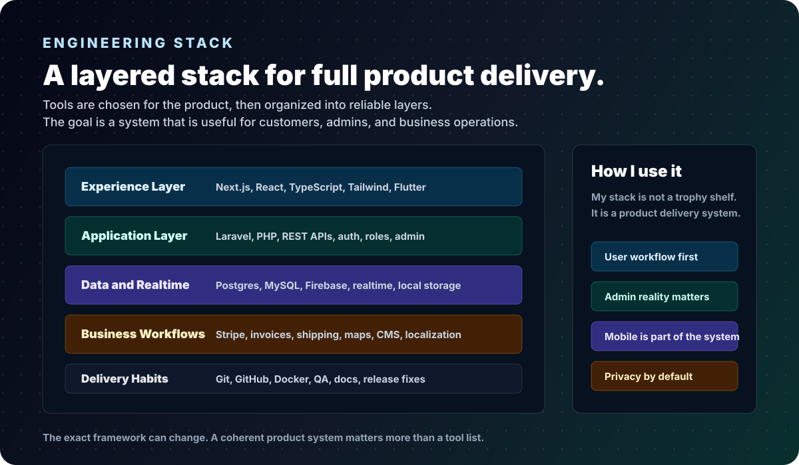
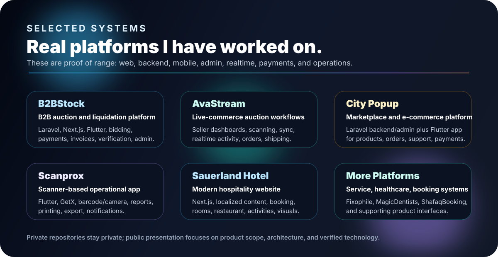

  

  
  
  

  

---

  

## Stack

  

  

<table>
  <tr>
    <td align="center"><strong>Backend</strong> Laravel, PHP, REST APIs, Sanctum, queues, notifications, roles, admin workflows</td>
    <td align="center"><strong>Frontend</strong> Next.js, React, TypeScript, Vite, Tailwind, dashboards, public sites, SEO-aware pages</td>
  </tr>
  <tr>
    <td align="center"><strong>Mobile</strong> Flutter, Dart, Riverpod, GetX, Firebase Messaging, local storage, scanner workflows</td>
    <td align="center"><strong>Business Systems</strong> Stripe, realtime channels, shipping/tracking, maps, PDF/invoices, translations, CMS content</td>
  </tr>
</table>

## Selected Work

  

<table>
  <tr>
    <td width="50%">
      <h3>B2BStock</h3>
      
<strong>B2B liquidation and pallet auction platform.</strong>

      
Laravel APIs, Next.js frontend, Flutter app, realtime bidding, buy-now flows, company verification, payments, invoices, translations, notifications, and admin operations.

      
<code>Laravel</code> <code>Next.js</code> <code>Flutter</code> <code>Stripe</code> <code>Realtime</code>

    </td>
    <td width="50%">
      <h3>AvaStream / Auktion Live</h3>
      
<strong>Live-commerce and auction workflow platform.</strong>

      
Seller dashboards, scanning, showcase sync, realtime auction activity, payment flows, shipping/tracking, admin tooling, and mobile-oriented live auction screens.

      
<code>Laravel</code> <code>React</code> <code>TypeScript</code> <code>Vite</code> <code>Firebase</code>

    </td>
  </tr>
  <tr>
    <td width="50%">
      <h3>City Popup</h3>
      
<strong>Marketplace and e-commerce platform.</strong>

      
Laravel backend/admin system plus Flutter app for shops, domains, products, cart, orders, reviews, support tickets, notifications, localization, and payments.

      
<code>Laravel</code> <code>Flutter</code> <code>Riverpod</code> <code>Firebase</code> <code>Pusher</code>

    </td>
    <td width="50%">
      <h3>Scanprox</h3>
      
<strong>Scanner-focused operational mobile app.</strong>

      
Role-based routing, camera and barcode flows, reports, pallet/order operations, batch export, printing, local notifications, and mobile/web operational workflows.

      
<code>Flutter</code> <code>Dart</code> <code>GetX</code> <code>Barcode</code> <code>PDF/Excel</code>

    </td>
  </tr>
</table>

## Public Code

<table>
  <tr>
    <td width="58%">
      <h3>Product Card UI Showcase</h3>
      
Public Flutter demo focused on product cards, pricing UI, discount badges, image loading, product detail navigation, and Material-style layouts.

      
<code>Flutter</code> <code>Dart</code> <code>Material UI</code>

    </td>
    <td width="42%" align="center">
       
      
    </td>
  </tr>
</table>

## GitHub Activity

  
  

## Private Work Policy

Private production work stays private. I do not publish source code, private repository names, credentials, admin screens, customer/company data, bids, invoices, payment records, verification documents, or internal URLs.

Instead, I document approved work through public-safe case studies focused on the product problem, my role, architecture, platform modules, and verified technologies.

## Contact

  
  

